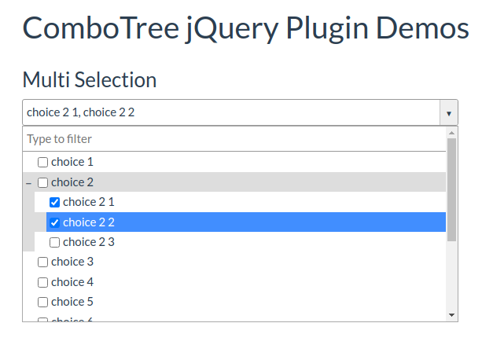
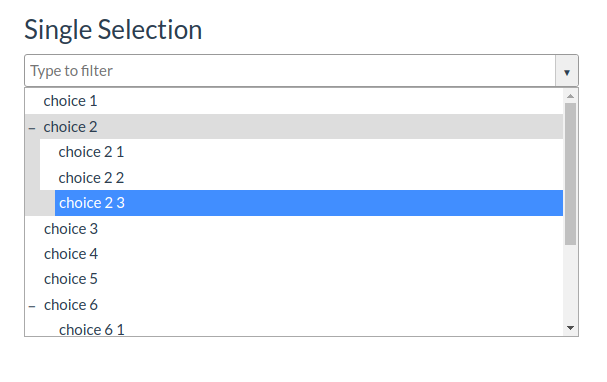

Yii2 Combo Tree
===============
Yii2 Combo Tree Select Extension

Installation
------------

The preferred way to install this extension is through [composer](http://getcomposer.org/download/).

Either run

```bash
php composer.phar require --prefer-dist mrmuminov/yii2-combo-tree "*"
```

or add

```
"mrmuminov/yii2-combo-tree": "*"
```

to the require section of your `composer.json` file.


Usage
-----

Once the extension is installed, simply use it in your code by  :

```php
<?= \MrMuminov\ComboTree\ComboTree::widget([
    'source' => [
        [
            'id' => 1,
            'title' => 'choice 1',
        ], 
        [
            'id' => 2,
            'title' => 'choice 2',
        ],
        [
            'id' => 3,
            'title' => 'choice 2 1',
            'parent_id' => 2,
        ], 
        [
            'id' => 4,
            'title' => 'choice 2 2',
            'parent_id' => 2,
        ], 
        [
            'id' => 5,
            'title' => 'choice 2 3',
            'parent_id' => 2,
        ], 
        [
            'id' => 6,
            'title' => 'choice 3',
        ], 
    ]
]); ?>
```

